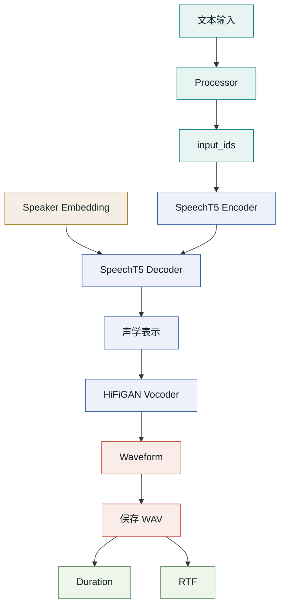

# TTS 原理解释图：边理论边看模型结构

这份图解配合 [00_tts_small_and_voxcpm2.ipynb](./00_tts_small_and_voxcpm2.ipynb) 阅读。重点不是把某个 `pipeline` API 背下来，而是把 TTS 的核心链路和 notebook 里的结构观察代码对应起来。

## 1. 总体原理图



如果 Mermaid 渲染不出来，可以先看这个纯文本版本：

```text
文本输入
  ↓
processor / tokenizer：文本转 input_ids
  ↓
SpeechT5 encoder：理解文本 token 序列
  ↓
speaker embedding：指定谁在说
  ↓
SpeechT5 decoder / postnet：生成声学表示
  ↓
HiFiGAN vocoder：声学表示转 waveform
  ↓
保存 WAV：采样率、时长、文件格式
  ↓
评估：RTF、延迟、音质、稳定性
```

## 2. 为什么这次不用黑盒 pipeline

旧的 ModelScope Sambert + HiFiGAN pipeline 可以跑通基础 TTS，但它有两个教学问题：

| 问题 | 影响 |
| --- | --- |
| Python 3.11/3.12 容易遇到 `ttsfrd` 兼容问题 | 学习会卡在环境错误，而不是 TTS 原理 |
| pipeline 封装太厚 | 不方便直接查看 encoder、decoder、postnet、vocoder |

新的 notebook 使用 ModelScope 下载模型文件，再用 Transformers 加载真实模型对象：

```python
from modelscope import snapshot_download
from transformers import SpeechT5ForTextToSpeech, SpeechT5HifiGan, SpeechT5Processor

tts_model_dir = snapshot_download("microsoft/speecht5_tts")
vocoder_model_dir = snapshot_download("microsoft/speecht5_hifigan")

processor = SpeechT5Processor.from_pretrained(tts_model_dir)
model = SpeechT5ForTextToSpeech.from_pretrained(tts_model_dir)
vocoder = SpeechT5HifiGan.from_pretrained(vocoder_model_dir)
```

这段代码的好处是：下载仍然走 ModelScope，结构查看走标准 PyTorch/Transformers。

## 3. 文本输入到底是什么

TTS 的输入不是音频，而是一段文本。第一步仍然是 NLP：

```python
inputs = processor(text=SYNTH_TEXT, return_tensors="pt")
input_ids = inputs["input_ids"]
tokens = processor.tokenizer.convert_ids_to_tokens(input_ids[0])
```

可以重点观察：

| 观察项 | 意义 |
| --- | --- |
| `input_ids.shape` | 一段文本被切成多少 token |
| `input_ids[0].tolist()` | 真实喂给模型的整数序列 |
| `tokens` | tokenizer 如何切分原始文本 |

默认 `microsoft/speecht5_tts` 更适合英文示例。如果换中文 TTS 模型，再把 `SYNTH_TEXT` 改成中文。

## 4. 声学模型内部怎么拆

notebook 先看 `model.config`：

```python
show_config(model.config, [
    "hidden_size",
    "encoder_layers",
    "decoder_layers",
    "speaker_embedding_dim",
    "reduction_factor",
    "num_mel_bins",
])
```

这些字段可以帮助你快速回答：

- 模型隐藏层有多宽。
- encoder 和 decoder 各有多少层。
- speaker embedding 维度是多少。
- 声学表示的 mel 维度是多少。

然后再看顶层模块：

```python
for name, child in model.named_children():
    print(name, type(child).__name__, count_parameters(child))
```

这一步能看出参数主要分布在哪些大模块里。

## 5. 怎么定位 encoder、decoder、attention、postnet

结构很深时，不要只靠肉眼翻 `print(model)`。更好的方式是按关键词查：

```python
for name, cls_name, params in find_modules_by_keyword(
    model,
    ["encoder", "decoder", "attention", "postnet", "prenet"],
):
    print(name, cls_name, params)
```

这类代码适合在真实项目里复用：

| 用途 | 方法 |
| --- | --- |
| 找 attention 层 | 搜索 `attention` |
| 找 encoder / decoder | 搜索 `encoder`、`decoder` |
| 找输出后处理 | 搜索 `postnet` |
| 挂 hook 或冻结参数 | 用 `named_modules()` / `named_parameters()` 定位路径 |

## 6. speaker embedding 是什么

SpeechT5 需要 speaker embedding 来指定“谁在说”。真实项目里，这个向量通常来自说话人库、speaker encoder 或参考音频。

notebook 为了不依赖外部数据集，用固定随机种子生成一个归一化 embedding：

```python
speaker_dim = model.config.speaker_embedding_dim
embedding = torch.randn((1, speaker_dim))
embedding = F.normalize(embedding, dim=-1)
```

它适合教学跑通链路，但不是最佳音色。真实产品里，speaker embedding 的质量会直接影响音色稳定性和克隆效果。

## 7. vocoder 为什么单独存在

SpeechT5 声学模型输出的是声学表示，不是最终音频。HiFiGAN vocoder 负责把声学表示变成 waveform：

```python
speech = model.generate_speech(
    input_ids,
    speaker_embeddings,
    vocoder=vocoder,
)
```

可以这样理解：

| 阶段 | 产物 | 角色 |
| --- | --- | --- |
| Processor | `input_ids` | 把文本变成 token |
| SpeechT5 encoder-decoder | 声学表示 | 预测“应该怎么发声” |
| HiFiGAN vocoder | waveform | 还原成可播放音频 |

## 8. forward hook 能看什么

notebook 里用 hook 记录关键模块的输入输出 shape：

```python
modules[name].register_forward_hook(make_hook(name))
```

默认观察：

```text
speecht5.encoder
speecht5.decoder
speech_decoder_postnet
```

这能帮助你回答：“文本 token 进入 encoder 后，decoder / postnet 产生了什么形状的中间表示？”如果想继续深入，可以把 hook 挂到 attention 层，看每一步生成时的内部张量变化。

## 9. 部署指标怎么解释

生成后保存 WAV，并计算：

```text
RTF = 生成耗时 / 音频时长
```

重点看：

| 指标 | 解释 |
| --- | --- |
| `sample_rate` | 采样率，影响音质和文件大小 |
| `duration_seconds` | 输出音频时长 |
| `elapsed_seconds` | 生成耗时 |
| `rtf` | 是否接近实时；小于 1 才有机会实时 |

## 10. 一句话讲清楚 TTS

> TTS 不是直接把字变成声音，而是先把文本变成 token，再结合说话人条件生成声学表示，最后由 vocoder 把声学表示还原成 waveform。部署时除了音质，还要看采样率、RTF、speaker embedding 来源、长文本切分和模型加载成本。
