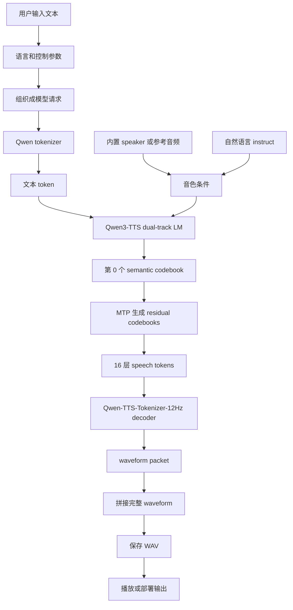

# Qwen3-TTS 教程：从文本输入到语音输出

这份教程专门拆 Qwen3-TTS。重点不是只会调用一个 API，而是知道输入的文本、音色条件、speech token、语言模型、codec decoder、waveform 之间怎样一步一步接起来。

本教程基于 Qwen 官方 README 和 Qwen3-TTS Technical Report。当前官方 README 已发布的是 12Hz 系列模型；技术报告里的 25Hz 系列主要作为结构对比学习。

## 1. 先用一句话理解

Qwen3-TTS 不是直接把文字变成声音。它先把文字变成文本 token，再让 Qwen3 语言模型预测一串离散的语音 token，最后由 Qwen-TTS-Tokenizer / Code2Wav 把这些语音 token 还原成真正可以播放的 waveform。

```text
文本 + 语言 + 音色控制
-> Qwen tokenizer
-> Qwen3-TTS 双轨语言模型
-> 语音 codebook token
-> Qwen-TTS-Tokenizer-12Hz decoder / Code2Wav
-> waveform
-> WAV 文件
```

## 2. 模型的组成结构

Qwen3-TTS 可以按下面几层理解：

| 层级 | 组件 | 作用 | 产物 |
| --- | --- | --- | --- |
| 文本入口 | Qwen tokenizer | 把输入文字切成模型能处理的 token | text token ids |
| 控制入口 | language、speaker、instruct、ref_audio、ref_text | 告诉模型语言、音色、语气、克隆参考音频 | 控制条件 / prompt |
| 主干模型 | Qwen3 LM backbone | 像文本大模型预测下一个词一样，预测后续语音 token | acoustic token 序列 |
| 流式结构 | dual-track representation | 把文本轨和语音轨一起建模，收到文本 token 后尽快预测对应语音 token | 可流式生成的 token 组 |
| 12Hz 细节预测 | MTP, Multi-Token Prediction | 先预测第 0 个 codebook，再补齐剩下的 residual codebooks | 多 codebook speech tokens |
| 语音编码器/解码器 | Qwen-TTS-Tokenizer-12Hz | 训练时把语音压成 token；推理时把 token 解回音频 | waveform |
| 音色保持 | speaker encoder / in-context prompt | 从参考音频或提示中保留“谁在说”和“怎么说” | speaker condition |
| 对外接口 | `Qwen3TTSModel` | 提供自定义音色、语音设计、语音克隆等函数 | `wavs, sr` |

注意两个容易混淆的点：

- `Qwen tokenizer` 处理的是文字。
- `Qwen-TTS-Tokenizer-12Hz` 处理的是语音 token 和 waveform，不是普通文本 tokenizer。

## 3. 已发布模型怎么选

当前官方 README 给出的 ModelScope / Hugging Face 模型主要是 12Hz 系列：

| 模型 | 适合做什么 | 是否流式 | 是否支持指令控制 |
| --- | --- | --- | --- |
| `Qwen/Qwen3-TTS-Tokenizer-12Hz` | 单独做语音 encode / decode 学习 | 是 | 不适用 |
| `Qwen/Qwen3-TTS-12Hz-0.6B-Base` | 低成本体验 3 秒快速音色克隆、微调起点 | 是 | 否 |
| `Qwen/Qwen3-TTS-12Hz-1.7B-Base` | 更高质量的音色克隆、微调起点 | 是 | 否 |
| `Qwen/Qwen3-TTS-12Hz-0.6B-CustomVoice` | 用官方内置音色快速合成 | 是 | 否 |
| `Qwen/Qwen3-TTS-12Hz-1.7B-CustomVoice` | 内置音色 + 语气/风格指令 | 是 | 是 |
| `Qwen/Qwen3-TTS-12Hz-1.7B-VoiceDesign` | 用自然语言描述创造新音色 | 是 | 是 |

学习建议：

- 想按主能力测试：先用 `1.7B-CustomVoice`。
- 显存不够或只想轻量试跑：再退回 `0.6B-CustomVoice`。
- 想研究音色克隆：看 `Base`。
- 想研究“用文字描述声音”：看 `1.7B-VoiceDesign`。
- 想理解语音 token：单独看 `Qwen3-TTS-Tokenizer-12Hz`。

## 4. 每一步的原理

### Step 1：准备输入

一次 TTS 请求通常不只是一个 `text`，还会带上语言、音色和控制信息。

```text
text: 要说什么
language: 用什么语言读
speaker: 用哪个内置音色
instruct: 用什么情绪、语速、风格
ref_audio: 克隆谁的声音
ref_text: 参考音频对应的文字
```

原理很简单：文本决定内容，音色条件决定“谁在说”，指令决定“怎么说”。

### Step 2：把文本整理成模型输入

Qwen3-TTS 训练时把数据组织成 ChatML 风格。你写代码时一般不用手动拼 ChatML，`qwen-tts` 包会根据函数参数整理输入。

这一步的输出可以理解为：

```text
文本 token + 语言字段 + 音色字段 + 指令字段
```

### Step 3：Qwen tokenizer 把文字切成 token

文字不能直接进神经网络，先要变成整数 token。这个过程和文本大模型类似。

```text
"你好，今天我们学习 Qwen3-TTS"
-> [token_1, token_2, token_3, ...]
```

这些 token 保留“说什么”的信息，还没有声音。

### Step 4：处理音色条件

Qwen3-TTS 有几种常见音色来源：

| 模式 | 输入 | 原理 |
| --- | --- | --- |
| CustomVoice | `speaker="Vivian"` 这类内置 speaker | 模型使用预定义音色条件 |
| VoiceDesign | `instruct="温柔、年轻、语速慢"` | 模型根据自然语言描述生成符合描述的声音 |
| VoiceClone | `ref_audio` + `ref_text` | 从参考音频或文本-音频对里提取说话人和韵律信息 |

技术报告里提到，音色克隆可以走 speaker embedding，也可以通过文本-语音对做 in-context learning。通俗地说，前者像“提取这个人的声音身份证”，后者像“给模型听一小段示范，再让它照着说”。

### Step 5：双轨语言模型开始预测语音 token

普通文本大模型预测的是下一个文字 token。Qwen3-TTS 的主干仍然是 Qwen3 LM，但目标变成了语音 token。

它使用 dual-track 思路：一条轨道放文本信息，一条轨道放语音信息。模型收到文本 token 后，就尽快预测对应的 acoustic tokens。

```text
文本轨:   t1   t2   t3   t4
语音轨:   a1   a2   a3   a4
```

这样做的好处是流式：不用等完整段落都处理完，前面的文本一进来，就可以开始预测前面的语音 token。

### Step 6：12Hz 多 codebook 怎么生成

12Hz 系列不是只预测一串单层 token，而是使用多 codebook。

可以把它理解成画图：

```text
第 0 层 codebook: 先画轮廓，主要保存语义内容
后 15 层 RVQ:     一层层补细节，补音色、韵律、声学质感
```

技术报告里写到，Qwen-TTS-Tokenizer-12Hz 是 12.5 Hz、16 层 multi-codebook 设计。第一个 codebook 更偏语义，后续 15 层 residual vector quantization 逐步补声学细节。

Qwen3-TTS-12Hz 生成时采用层级预测：

```text
Qwen3 backbone -> 预测第 0 个 codebook
MTP module     -> 预测剩余 residual codebooks
```

MTP 的作用是一次性把一帧里多个 codebook 补齐，避免模型慢慢一个一个吐细节，从而减少延迟。

### Step 7：语音 token 变成 waveform

模型生成的是离散 speech tokens，还不是声音。需要 Qwen-TTS-Tokenizer-12Hz 的 causal decoder / Code2Wav 把 token 解码成 waveform。

```text
speech tokens
-> codec decoder
-> 一段一段 waveform
-> 拼成完整音频
```

12Hz 系列使用纯左上下文的流式 codec decoder，不需要等未来 token 才能开始解码。所以它可以更早吐出第一包音频。

### Step 8：流式输出第一包音频

报告里给出的核心延迟概念是：

```text
First-Packet Latency = LM 生成第一组语音 token 的时间 + tokenizer 解码第一包音频的时间
```

12.5 Hz 表示大约每个 token 对应 80 ms 音频。为了减少调度开销，报告里把 4 个 token 作为一个 speech packet，也就是每包约 320 ms 音频。

这就是为什么它能面向实时交互：不是等整段文字都合成完，而是边生成 token，边解码音频包。

### Step 9：得到 `wavs, sr`

Python 接口最后通常返回：

```text
wavs: waveform 数组列表
sr: sample rate，采样率
```

保存时用 `soundfile.write`：

```python
import soundfile as sf

sf.write("output.wav", wavs[0], sr)
```

到这里，模型输出才真正变成播放器能播放的 WAV 文件。

### Step 10：看质量和部署指标

学习和部署时重点看这几项：

| 指标 | 通俗解释 |
| --- | --- |
| 音质 | 是否自然、有没有电流感、爆音、断裂 |
| 内容一致性 | 有没有念错字、漏字、多字 |
| 音色相似度 | 克隆时像不像参考音频 |
| 指令遵循 | 语速、情绪、年龄感、性别感是否符合描述 |
| first-packet latency | 用户等多久能听到第一段声音 |
| RTF | 生成耗时 / 音频时长，小于 1 才有实时可能 |
| 显存和并发 | 服务能不能同时处理多人请求 |

## 5. 从输入到输出的完整流程图



纯文本版本：

```text
1. 用户输入 text
2. 选择 language / speaker / instruct / ref_audio
3. qwen-tts 把请求整理成模型输入
4. Qwen tokenizer 把文字变成 text tokens
5. 音色模块准备 speaker condition 或 in-context prompt
6. Qwen3-TTS 主干根据文本和音色条件预测 speech tokens
7. 12Hz 模型先预测第 0 个 codebook
8. MTP 补齐剩余 15 层 residual codebooks
9. Qwen-TTS-Tokenizer-12Hz decoder 把 tokens 解成 waveform
10. 返回 wavs 和 sample rate
11. 写入 output.wav
12. 播放、评估或部署
```

## 6. ModelScope 平台怎么用

### 6.1 在线体验

可以先去官方 ModelScope 入口：

- ModelScope collection: <https://modelscope.cn/collections/Qwen/Qwen3-TTS>
- ModelScope Studio demo: <https://modelscope.cn/studios/Qwen/Qwen3-TTS>

如果只是体验音色、语速、情绪和克隆效果，先用 Studio demo。等你想看代码、缓存模型、放进自己的 Notebook，再本地下载。

### 6.2 在 ModelScope Notebook 下载模型

国内环境优先用 ModelScope：

```bash
pip install -U modelscope qwen-tts soundfile

modelscope download --model Qwen/Qwen3-TTS-Tokenizer-12Hz --local_dir ./Qwen3-TTS-Tokenizer-12Hz
modelscope download --model Qwen/Qwen3-TTS-12Hz-1.7B-CustomVoice --local_dir ./Qwen3-TTS-12Hz-1.7B-CustomVoice
modelscope download --model Qwen/Qwen3-TTS-12Hz-1.7B-Base --local_dir ./Qwen3-TTS-12Hz-1.7B-Base
```

如果只是轻量试跑，可以改用 0.6B：

```bash
modelscope download --model Qwen/Qwen3-TTS-12Hz-0.6B-CustomVoice --local_dir ./Qwen3-TTS-12Hz-0.6B-CustomVoice
modelscope download --model Qwen/Qwen3-TTS-12Hz-0.6B-Base --local_dir ./Qwen3-TTS-12Hz-0.6B-Base
```

### 6.3 自定义音色示例

这个例子适合先跑通：

```python
import torch
import soundfile as sf
from qwen_tts import Qwen3TTSModel

model = Qwen3TTSModel.from_pretrained(
    "./Qwen3-TTS-12Hz-1.7B-CustomVoice",
    device_map="cuda:0",
    dtype=torch.bfloat16,
)

wavs, sr = model.generate_custom_voice(
    text="今天我们从输入到输出拆解 Qwen3-TTS。",
    language="Chinese",
    speaker="Vivian",
)

sf.write("qwen3_tts_custom_voice.wav", wavs[0], sr)
```

如果你的机器支持 FlashAttention 2，可以在 `from_pretrained` 里加：

```python
attn_implementation="flash_attention_2"
```

如果不支持，就不要加这一行。

### 6.4 语音设计示例

VoiceDesign 的核心是用自然语言描述声音：

```python
import torch
import soundfile as sf
from qwen_tts import Qwen3TTSModel

model = Qwen3TTSModel.from_pretrained(
    "./Qwen3-TTS-12Hz-1.7B-VoiceDesign",
    device_map="cuda:0",
    dtype=torch.bfloat16,
)

wavs, sr = model.generate_voice_design(
    text="这是一段用于测试语音设计的中文合成。",
    language="Chinese",
    instruct="年轻女性，声音温柔自然，语速稍慢，情绪稳定。",
)

sf.write("qwen3_tts_voice_design.wav", wavs[0], sr)
```

这里的 `instruct` 不是给人看的注释，而是模型真正会读取的控制条件。

### 6.5 语音克隆示例

Base 模型用于克隆音色：

```python
import torch
import soundfile as sf
from qwen_tts import Qwen3TTSModel

model = Qwen3TTSModel.from_pretrained(
    "./Qwen3-TTS-12Hz-1.7B-Base",
    device_map="cuda:0",
    dtype=torch.bfloat16,
)

wavs, sr = model.generate_voice_clone(
    text="这句话会尽量使用参考音频里的音色来说。",
    language="Chinese",
    ref_audio="./reference.wav",
    ref_text="这里填写 reference.wav 对应的文字内容。",
)

sf.write("qwen3_tts_voice_clone.wav", wavs[0], sr)
```

克隆质量和参考音频强相关。参考音频最好干净、短、没有背景音乐，`ref_text` 要尽量和音频内容一致。

### 6.6 单独观察语音 tokenizer

如果你想专门理解“音频如何变成 token，再变回音频”，看这个：

```python
import soundfile as sf
from qwen_tts import Qwen3TTSTokenizer

tokenizer = Qwen3TTSTokenizer.from_pretrained(
    "./Qwen3-TTS-Tokenizer-12Hz",
    device_map="cuda:0",
)

codes = tokenizer.encode("./reference.wav")
wavs, sr = tokenizer.decode(codes)

sf.write("qwen3_tts_tokenizer_reconstruct.wav", wavs[0], sr)
```

这一步不需要输入文本。它只验证语音 codec：原始音频 -> discrete codes -> 重建音频。

## 7. 12Hz 和 25Hz 的区别

| 对比项 | 12Hz 系列 | 25Hz 系列 |
| --- | --- | --- |
| 当前官方 README 是否列为已发布主模型 | 是 | 报告中提到，README 里说其他报告模型后续发布 |
| token 频率 | 12.5 Hz | 25 Hz |
| codebook | 16 层 multi-codebook | single-codebook |
| 重点 | 低延迟、低 bitrate、流式体验 | 语义表达和长语音稳定性对比 |
| 解码 | 轻量 causal ConvNet / codec decoder | chunk-wise DiT + BigVGAN |
| 延迟特点 | 更快吐第一包音频 | 需要等待未来 token 和 chunk |

一句话理解：25Hz 像更密的语音刻度，12Hz 像更省的语音编码。Qwen3-TTS 当前开放使用更强调 12Hz，因为它更适合低延迟流式合成。

## 8. 和旧 TTS 模型的区别

和前一个教程里的 SpeechT5 / HiFiGAN 链路相比，Qwen3-TTS 更像“语音版大语言模型”：

| 旧式理解 | Qwen3-TTS 理解 |
| --- | --- |
| 文本 -> 声学特征 -> vocoder | 文本 token -> speech tokens -> codec decoder |
| encoder-decoder TTS 模型 | Qwen3 LM 自回归生成语音 token |
| speaker embedding 常常是额外输入 | speaker、instruct、ref_audio 都可以成为控制条件 |
| 更偏离线合成 | 强调流式、低首包延迟和并发 |

所以学习 Qwen3-TTS 时，不要只盯着“声学模型 + vocoder”。更重要的是理解“离散语音 token + 语言模型生成 + codec 解码”。

## 9. ModelScope Notebook 练习顺序

建议按这个顺序练：

1. 打开 ModelScope Studio demo，先听不同模型和音色差异。
2. 在 ModelScope Notebook 安装 `qwen-tts`。
3. 下载 `1.7B-CustomVoice`，先合成一段中文。
4. 改 `speaker` 和 `language`，看内容和音色怎么变。
5. 换 `1.7B-VoiceDesign`，改 `instruct`，观察语气、年龄感、速度变化。
6. 准备一段干净参考音频，用 `Base` 跑 voice clone。
7. 单独调用 `Qwen3TTSTokenizer.encode/decode`，理解 speech token。
8. 记录生成耗时和音频时长，计算 RTF。

RTF 可以这样算：

```python
import time
import soundfile as sf

start = time.perf_counter()
wavs, sr = model.generate_custom_voice(
    text="这是一段用于计算实时因子的语音。",
    language="Chinese",
    speaker="Vivian",
)
elapsed = time.perf_counter() - start

duration = len(wavs[0]) / sr
rtf = elapsed / duration

print({"elapsed": elapsed, "duration": duration, "rtf": rtf})
sf.write("rtf_test.wav", wavs[0], sr)
```

## 10. 常见问题

### 没有 GPU 能不能跑

不建议用 CPU 跑 1.7B。学习结构可以读这份教程和官方 README；真正生成语音建议用 ModelScope Notebook GPU 或本地 CUDA GPU。

### 为什么要用 Python 3.12

官方 quickstart 推荐 Python 3.12。这个仓库根目录的 `python_version` 也是 3.12，和 ModelScope Notebook 更匹配。

### 显存不够怎么办

默认教程已经换成 `1.7B-CustomVoice`。如果下载太慢、显存不够或只想轻量试跑，把模型 ID 改成 `Qwen/Qwen3-TTS-12Hz-0.6B-CustomVoice`。

### 为什么语音克隆要 `ref_text`

参考音频告诉模型“声音像谁”，`ref_text` 告诉模型“这段参考音频说了什么”。两者对齐后，模型更容易分清内容和音色，克隆更稳。

### 为什么 TTS 也要看 tokenizer

因为 Qwen3-TTS 的中间产物是离散 speech tokens。看懂 tokenizer，才能看懂模型到底在生成什么。

## 11. 官方参考

- Qwen3-TTS GitHub README: <https://github.com/QwenLM/Qwen3-TTS>
- Qwen3-TTS Technical Report: <https://arxiv.org/abs/2601.15621>
- ModelScope Qwen3-TTS collection: <https://modelscope.cn/collections/Qwen/Qwen3-TTS>
- ModelScope Qwen3-TTS Studio demo: <https://modelscope.cn/studios/Qwen/Qwen3-TTS>
